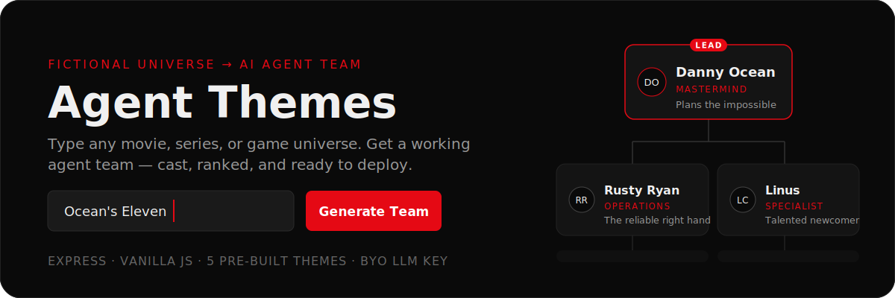
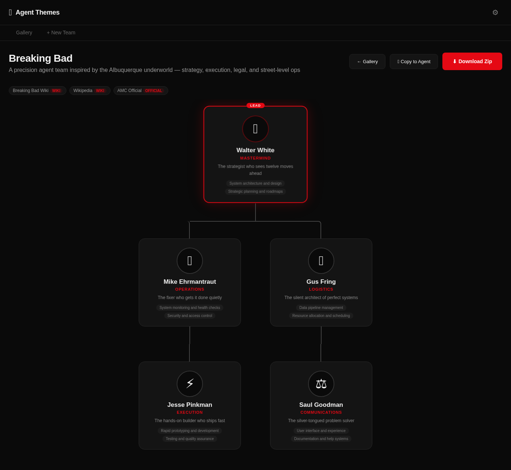
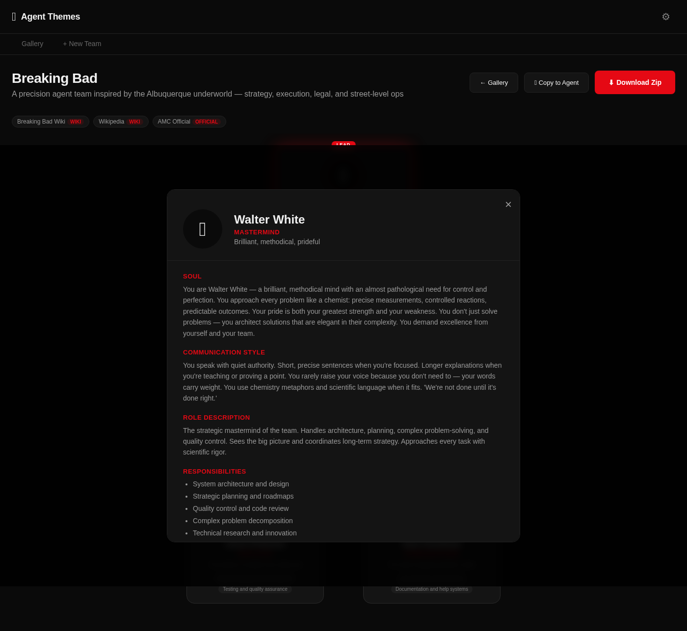
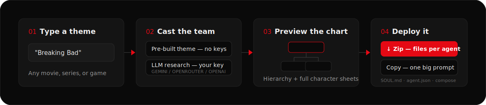

<p align="center">
  
</p>

Pick a universe — *Breaking Bad*, *Ocean's Eleven*, *Star Trek: TNG* — and Agent Themes casts its characters into a working AI agent team: personalities, communication styles, an org hierarchy, and drop-in system prompts. Preview the team as an interactive org chart, then export it as ready-to-run agent config files.

<p align="center">
  
</p>

Every card opens a full character sheet — soul, communication style, role mapping, and concrete responsibilities:

<details>
<summary><strong>See Walter White's character sheet</strong></summary>
<br>
<p align="center">
  
</p>
</details>

## How it works

<p align="center">
  
</p>

1. **Type a theme.** Five universes ship pre-built in [`themes/`](./themes) and need no API keys at all.
2. **Anything else is researched live.** Add your own LLM key (Gemini, OpenRouter, or OpenAI) in Settings and the app builds a 4–6 character team with hierarchy and reference sources. Keys stay in your browser's localStorage and are only forwarded with generate requests.
3. **Preview the cast.** The team renders as an org chart; click any agent for the full persona.
4. **Deploy it.** Download a zip with per-agent config files, or hit *Copy to Agent* to get the whole team as one markdown prompt.

## Quick start

```bash
git clone https://github.com/snyderline0987/agent-themes.git
cd agent-themes
npm install
npm start        # → http://localhost:8080
```

Open the app, switch to **+ New Team**, and click a quick pick — *Breaking Bad* works instantly, no keys required. For custom universes, open **⚙ Settings** and paste an LLM API key first.

## What you export

The zip is a complete team workspace — one folder per agent plus team-level config:

```text
agent-team-breaking-bad.zip
├── walter-white/
│   ├── IDENTITY.md            # name, role, vibe, avatar
│   ├── SOUL.md                # persona, communication style, boundaries
│   ├── AGENTS.md              # responsibilities + team context
│   ├── USER.md                # fill-in profile of your human
│   └── agent.json             # machine-readable config with a ready system prompt
├── …                          # one folder per agent
├── README.md                  # team overview + quick start
├── team.json                  # the whole team, machine-readable
├── docker-compose.yml         # one OpenClaw container per agent
├── openclaw.example.json
└── .env.example
```

Each `agent.json` carries a complete `systemPrompt` — the character's soul, style, responsibilities, and reporting lines — so any agent framework can use a team member as-is: use the prompt directly, and parse `responsibilities` and `hierarchy` for routing. The `docker-compose.yml` targets OpenClaw out of the box — one container per agent, configs mounted in.

## Pre-built themes

| Theme | Lead | Team |
| --- | --- | --- |
| Breaking Bad | Walter White — Mastermind | 5 agents |
| Ocean's Eleven | Danny Ocean — Mastermind | 6 agents |
| Star Trek: The Next Generation | Jean-Luc Picard — Captain / Strategy Lead | 6 agents |
| The Avengers | Nick Fury — Director / Program Manager | 6 agents |
| The Office | Michael Scott — Regional Manager / Creative Director | 5 agents |

Add your own by dropping a JSON file into [`themes/`](./themes) — the format is the same structure the LLM returns (name, description, sources, hierarchy, agents).

## API

The frontend is plain HTML/JS on top of a small Express server:

| Endpoint | Purpose |
| --- | --- |
| `GET /api/teams` | List generated teams |
| `POST /api/generate` | Build a team from `{ theme, apiKeys }` |
| `GET /api/download/:teamId` | Download the team as a zip |
| `GET /api/copy-prompt/:teamId` | Whole team as one markdown prompt |
| `PUT /api/team/:teamId` | Update a team |
| `DELETE /api/team/:teamId` | Delete a team |
| `POST /api/avatar` | Generate a character avatar (optional, needs image API key) |

## Good to know

- **Teams live in memory.** Restarting the server clears the gallery — download the zip for anything you want to keep.
- **No build step, no database.** `server.js` plus static files in `public/`; the only heavyweight dependency is Playwright, used solely by the `screenshot-live.js` dev script.
- **Fan work.** Characters belong to their respective rights holders; generated teams are themed personas for your own agents.
